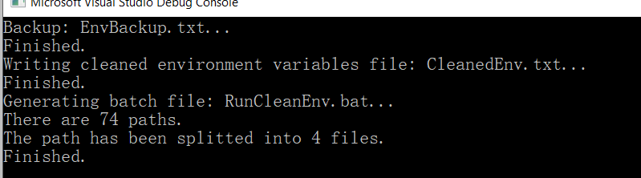

A Simple Tool to Split Long Windows Environment Variable

1. Run **.exe** in the **release** folder.
2. Run the generated **.bat** file with admin.

## Effect

## Internal

This tool will delete empty path before generating the batch file. Then using **setx** to set system environment.